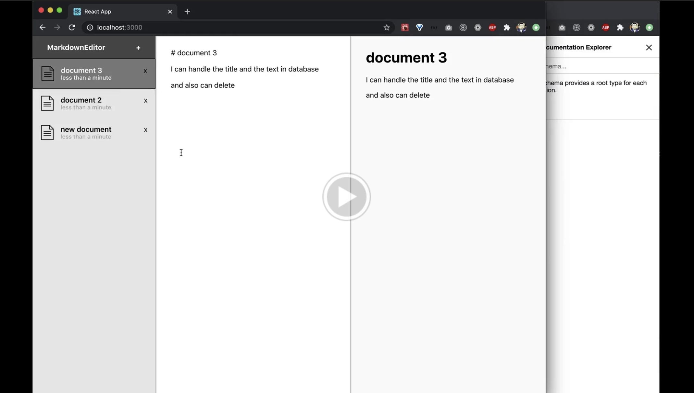
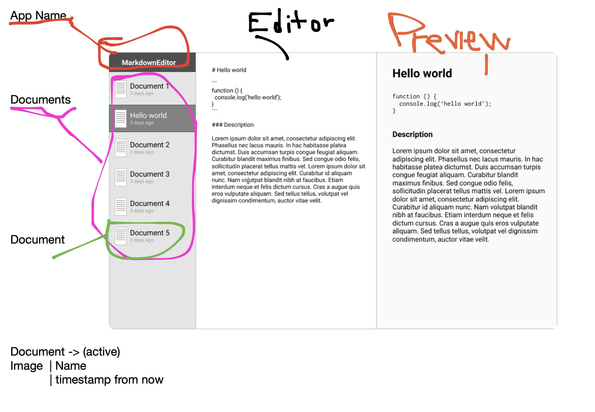

# markdown-docs
A markdown editor app.

## Installation

The project is build for dev mode via docker-compose

```sh
docker-compose up
```

This going to download alpine images with node services and postgres services.
  -  frontend: node:14.9-alpine
  -  backend: node:14.9-alpine
  -  database: postgres:12.0-alpine
  
## Demo

[](https://drive.google.com/file/d/18n0puWU0gFQWKtJEGloiZxX_4CfcdMSu/view?usp=sharing)


## Docs

### Frontend 

Basic idea of the components:



Implementing [autosave](https://www.bradcypert.com/autosaving-with-react-hooks/) idea thanks to Brad Cypert

### Backend

With the idea of the app the data to store should be:

**Documents** Table


| Field      | Type      |
| -----------|:---------:|
| id         | int PK    |
| title      | varchar   |
| content    | text      |
| created_at | timestamp |
| updated_at | timestamp |

## Deploy
Test and deploys with GitHub Actions <3
